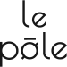

<!-- PROJECT LOGO -->
 

  

<h3 align="center">PIL_project</h3>

  

    Project aiming to remake the website of the Pôle Image de Liège to better fit its new image
  

<!-- TABLE OF CONTENTS -->

  
Table of Contents

  <ol>
    <li>
      <a href="#about-the-project">About The Project</a>
      <ul>
        <li><a href="#built-with">Built With</a></li>
      </ul>
    </li>
    <li><a href="#contact">Contact</a></li>
    <li><a href="#acknowledgments">Acknowledgments</a></li>
  </ol>

<!-- ABOUT THE PROJECT -->
## About The Project

[![lien vers le site à ajouter][product-screenshot]](https://example.com)

This project was made during a [BeCode](https://becode.org/) formation, and was used as a learning experience for the developpers.

(<a href="#top">back to top</a>)

### Built With

* [Wordpress](https://wordpress.com/)
* [Sass](https://sass-lang.com/)

(<a href="#top">back to top</a>)

<!-- CONTACT -->
## Contact

Project Link: [https://github.com/StephanieAn/PIL_project](https://github.com/StephanieAn/PIL_project)

Stéphanie Antignac - [github](https://github.com/StephanieAn) - [linkedin](www.linkedin.com/in/stéphanie-antignac)

Naim Zian - [github](https://github.com/Naim350Z) - [linkedin]()

Adrien Péters - [github](https://github.com/Doxh23) - [linkedin]()

Zoé Ranzy - [github](https://github.com/hawkstan) - [linkedin](https://www.linkedin.com/in/z-m-ranzy/)

(<a href="#top">back to top</a>)

<!-- ACKNOWLEDGMENTS -->
## Acknowledgments

* [BeCode](https://becode.org/)

(<a href="#top">back to top</a>)

<!-- MARKDOWN LINKS & IMAGES -->
<!-- to put a preview of the site on the about section -->
[product-screenshot]: images/screenshot.png